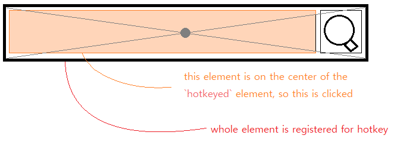
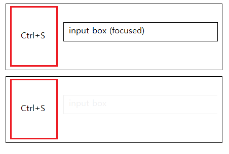

# vue-simple-hotkey

Simple hotkey module for vue.js.


## Usage

Install with:

```
npm i vue-simple-hotkey
```

Activate with:


```js
import VueSimpleHotkey from 'vue-simple-hotkey'
Vue.use(VueSimplehotkey)
```

Register hotkey with `v-hotkey` directive.

```html
<button v-hotkey='"enter"' @click='myMethod'></button>
```

Multiple hotkeys for an element could be registered.

```html
<button v-hotkey="['enter', 'ctrl+s']" @click='myMethod'></button>
```

To create hotkey without any visible thing, use empty `<span>` element with
`@click` handler. You may even use `display:none;` here.

```html
<span v-hotkey='"enter"'></span>
```


If you're using [pug](https://pugjs.org/) and you hate `'"` or `"'`, you may use an array syntax.

```pug
button(v-hotkey=['enter'])
```

Hotkeys without modifiers (ctrl, shift, alt) are automatically disabled when an input element (`input`, `textarea`, `div` w/ `contenteditable`) is focused.

```html
<textarea>blahblah</textarea> <!-- while this element is focused-->
<button v-hotkey="['enter']"> This hotkey won't work </button>
<button v-hotkey="['ctrl+s']"> This hotkey WILL work </button>
```

*Exception) ESC will work without any modifiers.*
```html
<button v-hotkey="['esc']"> This too will work </button>
```

Sometimes you'll want to restrict the range of hotkey to specific DOM element. You can set the range using `v-hotkey:(depth)`. In the case below, hotkey will work when `depth_1` is focused, but it won't when `depth_2` is focused.
```html
<div>
  <button v-hotkey:1='"ctrl+s"'><button>  <!-- button element itself is depth 0 -->
  <input name="depth_1">
</div>
<input name="depth_2">
```

## Descriptions: what this plugin does to make everything just work.

This plugin tries to *just work™* in most cases. This is achieved with some complex rules.

### Hotkey triggers a `click`. A reasonable one.

Basically this plugin simulates a 'mouse click'. `<button>` is clicked. `<span>` is clicked. `<input>` is clicked (hence focused)

Click events are given by `el.dispatchEvent(new MouseEvent('click'))`. Some components (like `vue-multiselect`) work on other events like `mousedown`, and such components should be overridden. An API for overrides should be opened soon.

You may want to register hotkey to some nested DOM.

```html
<!-- Some custom component called fancy-button -->
<div class='fancy-button-wrapper'>
  <!-- UI stuff with a very complex structure. -->
</div>


<!----------------------------------->


<!-- some other component -->
<fancy-button v-hotkey="'ctrl+s'">Amazing Very Fancy Wow</fancy-button>
```

When you're registering hotkey on such DOM, the **child on top of the center of parent's boundary box** will be clicked instead.



The event is bubbling, so you may give click event handler to either parent or child. Things will somehow just work.

This mechanism won't work if some other non-child is overlaying over center point. In such cases a `click` event will be dispatched to the original element.

### Hotkey conflict resolution

When multiple elements registeres the same hotkey, the element with the closest common ancestor is selected. For instance, in a case like below image, the upper red element is triggered.


